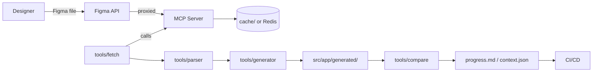

# figma-to-angular — Requirement (final, production-ready)

## Quick statement
Single-source requirement to build an AI-driven Figma → Angular generator, comparator, and resumable execution pipeline. Use this file to drive IDE/AI (Copilot) implementation. Provide only Figma specifics in `.env`.

## Where to find tech decisions
Detailed tech choices, diagrams, and runtime flows live in `techstack.md`. Implementers must consult `techstack.md` for concrete libraries and infra choices.

---

## 1. Project basics
- Project name: `figma-to-angular`.  
  To change: update `package.json` `name` and run a repo-wide search/replace for `figma-to-angular`.
- Primary goal: convert Figma designs into production-quality Angular code (`.ts`, `.html`, `.scss`) and optionally patch existing components to match design.
- Target frameworks: Angular **17+**, Node.js **18+**, TypeScript **strict**.

## 2. Principle requirements
- Production-grade code generation.
- SOLID design, modular services, test coverage.
- Resumable execution via `progress.md` and `tools/cache/context.json`.
- Secrets stored outside repo (MCP vault / env).
- Minimal human intervention: AI/IDE must be able to resume from `progress.md`.

## 3. Scope and non-goals
**In-scope**
- MCP-based Figma fetching and token management.
- Parser → canonical UI schema.
- Angular generator: standalone components, OnPush, typed Inputs/Outputs.
- Comparison engine: semantic diffs (AST) + CSS delta generation.
- `progress.md` append-only runtime log.
- CI pipeline with generate-check.

**Non-goals**
- Perfect pixel replication for advanced effects (filters, complex masks).
- Full interactive state machine generation beyond skeleton bindings.
- Auto-generation of backend business logic.

## 4. Stakeholders
- Frontend devs.  
- Designers.  
- SRE/DevOps.  
- Product owner.  
- AI/IDE agents (Copilot, LLM agent).

---

## 5. High-level architecture (summary)
- MCP Server (Node+TS) — Figma proxy, token rotation, audit, queue.
- Figma Connector CLI `tools/fetch.ts` — calls MCP.
- Parser & Normalizer `tools/parser.ts` — raw Figma JSON → canonical schema.
- Code Generator `tools/generator.ts` — templates → Angular files.
- Comparison Engine `tools/compare.ts` — AST + CSS heuristics → patch/dry-run/apply.
- Progress Tracker `progress.md` and `tools/cache/context.json`.
- Dev CLI to orchestrate steps.



---

## 6. Tech reference (short)
See `techstack.md` for full stack and runtime diagrams. Minimal pointers:
- Node.js + TypeScript for MCP and tools.
- Angular 17+ for generated app.
- LLMs via Ollama or OpenAI; orchestrate with LangChain.js.
- AST tooling: `ts-morph`. CSS analysis: `postcss` / `stylelint`.  
- Repository: Nx monorepo recommended.

---

## 7. Environment / .env (required)
Create root `.env` (never commit). Required keys:
```
FIGMA_FILE_ID=...
FIGMA_TOKEN_STORE=mcp   # or "env" if using env-stored token; prefer MCP vault
MCP_URL=https://mcp.example.com
MCP_API_KEY=...
NODE_ENV=development
```
MCP holds the actual Figma tokens; `.env` points to MCP and file keys.

---

## 8. Folder layout (recommended)
```
/
├─ src/                       # Angular app
│  ├─ app/
│  └─ styles/
├─ tools/
│  ├─ mcp/                    # MCP server (src, Dockerfile, helm/)
│  ├─ fetch.ts                # Figma connector CLI
│  ├─ parser.ts
│  ├─ generator.ts
│  ├─ compare.ts
│  ├─ apply.ts
│  ├─ resume.ts
│  └─ cache/                  # generated JSON and assets
├─ docs/
├─ tests/
├─ .github/workflows/
├─ progress.md
├─ tools/cache/context.json
├─ package.json
└─ README.md
```

---

## 9. Repo bootstrap (commands)
```bash
ng new figma-to-angular --strict --routing --style=scss
cd figma-to-angular
git init
mkdir -p tools/{mcp,cache,parser,generator}
npm install --save-dev ts-node typescript @types/node eslint prettier jest cypress axios commander ejs ts-morph postcss stylelint
```

Add `package.json` scripts:
```json
"scripts": {
  "mcp:dev": "ts-node tools/mcp/src/server.ts",
  "mcp:start": "node tools/mcp/dist/server.js",
  "fetch": "ts-node tools/fetch.ts",
  "parse": "ts-node tools/parser.ts",
  "generate": "ts-node tools/generator.ts",
  "compare": "ts-node tools/compare.ts",
  "apply": "ts-node tools/apply.ts",
  "resume": "ts-node tools/resume.ts",
  "test": "jest",
  "e2e": "cypress run"
}
```

---

## 10. MCP Server — detailed requirements
**Purpose:** centralize Figma access, protect tokens, queue/limit, audit, emit events, update `progress.md`.

**Tech:** Node + TypeScript + Express or Nest. Dockerfile + helm stub.

**Config (env):**
- `MCP_PORT`, `MCP_API_KEY`, `MCP_VAULT_URL`, `MCP_CACHE_TTL`, `MCP_RATE_LIMIT`.

**Endpoints (examples)**
- `POST /v1/fetch/file`  
  Payload:
  ```json
  { "fileId":"<id>", "nodeIds":["..."], "scale":2, "format":"svg|png|png@2x" }
  ```
  Response:
  ```json
  { "sha":"<sha>", "jsonPath":"tools/cache/figma-<sha>.json", "assets":["tools/cache/assets/..."] }
  ```
- `GET /v1/assets/:sha/:name`
- `POST /v1/token/rotate` (admin)
- `POST /v1/progress` (append progress entry)
- `GET /v1/health` and `/metrics`

**Caching & audit**
- Cache raw JSON and assets on disk or Redis with TTL.
- Append immutable audit log entries `{timestamp, caller, endpoint, requestSha, responseSha}`.

**Rate-limiting**
- Per-client & global limits. Queue requests when limits reached. Provide webhook or polling for completion.

**Security**
- TLS in prod. Validate all inputs. Never log secrets.

**Deploy**
- Dockerfile + sample systemd/helm configs.

**CLI**
- `mcpctl fetch --file FILE_ID --nodes id1,id2 --out tools/cache/figma-<sha>.json`

---

## 11. Figma Connector (`tools/fetch.ts`)
- Reads `MCP_URL` and `MCP_API_KEY`. Calls MCP `/v1/fetch/file`.
- Writes `tools/cache/figma-<sha>.json` and assets to `tools/cache/assets/`.
- Writes fetch metadata `tools/cache/fetch-meta-<sha>.json`.
- Command:
```bash
MCP_URL=https://mcp.example.com npm run fetch -- --file $FIGMA_FILE_ID --nodes id1,id2 --out tools/cache/figma-<sha>.json
```

---

## 12. Parser & canonical schema (`tools/parser.ts`)
- Input: `tools/cache/figma-<sha>.json`
- Output: `tools/cache/schema-<sha>.json` (canonical)
- Schema (exact fields):
```json
{
  "id":"string",
  "name":"string",
  "type":"FRAME|COMPONENT|INSTANCE|GROUP|TEXT|VECTOR|IMAGE",
  "layerType":"frame|component|text|vector|image",
  "props": { "x":0,"y":0,"w":0,"h":0, "metadata":{} },
  "children":[ /* same schema */ ],
  "style":{
    "fills":[],
    "strokes":[],
    "font":{"family":"","size":0,"weight":""},
    "spacing":{"padding":0,"margin":0},
    "tokens":{"color":"primary-500","spacing":"s-2"}
  },
  "tokensUsed":["string"]
}
```
- Responsibilities:
  - Normalize names (kebab-case).
  - Extract components, instances, overrides.
  - Map Figma styles → token references.
  - Validate output vs JSON schema (fail early).

**Unit tests:** parser must have unit tests with fixtures validating schema.

---

## 13. Design tokens generation
- Generate:
  - `src/styles/_tokens.scss` (SCSS variables)
  - `src/styles/tokens.css` (CSS custom properties)
- Mapping table example:
  - `Figma: Primary/500` → `$color-primary-500: #123456;` and `--color-primary-500: #123456;`
- Token generation must be idempotent and produce deterministic hash for `context.json`.

---

## 14. Component mapping rules
- `Frame` → Route / Page component. If frame name includes `Page:` treat as route.
- `Component` → Standalone Angular component under `src/app/generated/<component-name>/`.
  - Use `component-name.component.ts`, `.html`, `.scss`.
  - Default: standalone components + `changeDetection: OnPush`.
- `Instance` → component usage with `@Input()` properties for overrides.
- Text → `<p>`/`<span>` with binding when variable.
- Images/SVG → copy to `src/assets/generated/` and reference by path.
- Naming: normalize to `kebab-case`. Avoid collisions; if collision, append short hash.

---

## 15. Layout mapping rules
- Map Figma Auto Layout to CSS Flexbox by default.
- Use CSS Grid if explicit columns are present.
- Breakpoints:
  - mobile ≤ 640px
  - tablet 641–1024px
  - desktop > 1024px
- Create SCSS mixins for spacing tokens and responsive utilities.

---

## 16. Code generator (`tools/generator.ts`)
- Use templating (EJS/Handlebars) or Angular Schematics for programmatic generation.
- Output minimal, strictly typed components; avoid inline styles.
- Minimal sample templates:

`component.ts` (template)
```ts
import { Component, Input } from '@angular/core';
@Component({
  selector: 'gen-<%= name %>',
  standalone: true,
  templateUrl: './<%= name %>.component.html',
  styleUrls: ['./<%= name %>.component.scss'],
  changeDetection: 0
})
export class <%= className %> {
  @Input() data?: any;
}
```

`component.html` (template)
```html
<div class="gen-<%= name %>">
  <!-- mapped structure -->
</div>
```

`component.scss` (template)
```scss
.gen-<%= name %> {
  @include token-spacing(s-2);
}
```

- Ensure generated code passes `ng build`.

---

## 17. Comparison engine (`tools/compare.ts`)
- Use `ts-morph` to parse `.ts` and produce semantic diffs.
- For HTML/CSS compare DOM structure and styles; use heuristic thresholds (default 2px).
- CLI flags:
  - `--dry-run` (report only)
  - `--apply` (apply patches)
  - `--threshold <px>`
- Output formats:
  - Machine JSON diff
  - Human-readable patch (and optional PR creation details)

---

## 18. Tests and Acceptance Criteria
**Unit tests**
- Parser tests validate canonical schema.
- Token generator tests validate variable mappings.

**Integration**
- `ng build` on generated project must succeed.

**E2E / Visual**
- Cypress snapshot tests for generated pages.
- Visual diff tolerance default `2px` (configurable).

**Acceptance example**
- Figma fetch success if `tools/cache/figma-<sha>.json` exists and contains requested nodes.
- Parser success if `schema-<sha>.json` matches JSON schema.
- Generator success if `ng build` returns 0 and Cypress snapshots pass within tolerance.
- Compare success if known sample mismatches are detected in provided fixtures.

---

## 19. CI / CD (sample)
Use GitHub Actions. Jobs:
- `lint` (ESLint + stylelint)
- `test` (unit)
- `generate-check` (run `npm run fetch && npm run parse && npm run generate -- --dry-run`)
- `build` (ng build)

Minimal workflow snippet:
```yaml
jobs:
  validate:
    runs-on: ubuntu-latest
    steps:
      - uses: actions/checkout@v4
      - uses: actions/setup-node@v4
      - run: npm ci
      - run: npm run lint
      - run: npm run test
      - run: npm run generate -- --dry-run
```

---

## 20. Progress tracking — embedded template & rules (must be implemented **in repo root**)
**Purpose:** single source of truth for runtime state. Tools and MCP must create and update this file.

**Append-only YAML block schema (per step)**
```yaml
- step_id: <unique id>
  description: <text>
  status: <not-started | in-progress | done | blocked>
  started_at: <ISO8601 UTC | null>
  finished_at: <ISO8601 UTC | null>
  command: <exact command run>
  inputs: { ... }
  outputs: [ ... ]
  artifacts: [ path1, path2 ]
  sha: <sha1 of outputs or null>
  notes: <short text>
  pr: <optional PR URL>
  error: <error summary if blocked>
```

**Rules**
1. **Append-only:** do not modify existing entries. Append new entries for retries or next steps.
2. **Before executing** a step, append a row with `status: in-progress` and `started_at`.
3. **On success** append `status: done` with `finished_at`, `artifacts`, and `sha`.
4. **On failure** append `status: blocked` with `error` and reproduction `command`.
5. **Machine resume:** `tools/resume.ts` reads `progress.md` and determines the last `in-progress` or `blocked` entry and returns the next `not-started` command.

**Initial entry (example)**
```yaml
- step_id: init.requirements.loaded
  description: Requirements loaded and progress.md initialized
  status: done
  started_at: 2025-08-17T00:00:00Z
  finished_at: 2025-08-17T00:00:00Z
  command: init
  inputs: {}
  outputs: [progress.md]
  artifacts: []
  sha: null
```

**tools/resume.ts spec**
- Read `progress.md`.
- If last `in-progress` found: return command to reproduce and latest artifact paths.
- Else return next `not-started` step and command.
- Provide `--apply` or `--dry-run` suggestions.

---

## 21. Context store (`tools/cache/context.json`)
After each `done` step, also persist a small JSON object:
```json
{
  "last_sha":"<sha>",
  "last_step":"step_id",
  "schemaPath":"tools/cache/schema-<sha>.json",
  "tokensPath":"src/styles/_tokens.scss"
}
```
This aids quick programmatic resume.

---

## 22. Developer workflow (recommended)
- Initialize: `npm ci`
- Start MCP (dev): `npm run mcp:dev`
- Fetch design: `npm run fetch -- --file $FIGMA_FILE_ID`
- Parse schema: `npm run parse -- --input tools/cache/figma-<sha>.json`
- Generate code: `npm run generate -- --schema tools/cache/schema-<sha>.json`
- Compare: `npm run compare -- --component header --dry-run`
- Apply patches: `npm run apply -- --patch tools/patch-123.json`

---

## 23. Security and operations
- Store Figma tokens in MCP vault. Do not commit tokens.
- Use TLS on MCP in production.
- Limit access to `mcpctl` via API keys.
- Audit every fetch.

---

## 24. Commit & PR rules
- Use Conventional Commits.
- Keep generator changes in atomic commits per component.
- When `--apply` modifies repo, create a feature branch `feat/gen/<component>-<sha>` and open PR with diff and `progress.md` entry linking to PR.

---

## 25. Acceptance checklist (deliverable criteria)
- `tools/cache/figma-<sha>.json` produced from `mcpctl` fetch.
- `tools/cache/schema-<sha>.json` validates against schema.
- `src/styles/_tokens.scss` generated with deterministic sha.
- `ng build` succeeds for generated project.
- Cypress snapshots for target pages pass within configured tolerance.
- `progress.md` contains consistent append-only history.
- CI job `generate-check` runs and exits with 0 for valid designs.

---

## 26. Constraints & assumptions
- Angular 17+ default. Node 18+. TypeScript strict. Change only with update to `techstack.md`.
- Pixel tolerance default 2px; config via `tools/config.json`.
- Generator aims high-fidelity layout and tokens; complex visual effects handled as best-effort annotations.
- The only external required input from developer is `.env` with Figma file ID and MCP connection info.

---

## 27. Deliverables
- `requirement.md` (this file) — canonical instructions.
- `techstack.md` — concrete libraries and runtime diagrams.
- `progress.md` template (generated on first run).
- `tools/mcp/` server implementation.
- `tools/fetch.ts`, `tools/parser.ts`, `tools/generator.ts`, `tools/compare.ts`, `tools/apply.ts`, `tools/resume.ts`.
- Tests and CI configuration.

---

## 28. Next actions for AI/IDE (one-shot list)
1. Create `progress.md` with initial entry.
2. Implement `tools/mcp/` skeleton server (endpoints + Dockerfile).
3. Implement `tools/fetch.ts` to call MCP.
4. Implement `tools/parser.ts` with schema validation and unit tests.
5. Implement token generator and write `_tokens.scss`.
6. Implement `tools/generator.ts` templates for Angular files.
7. Implement `tools/compare.ts` using `ts-morph`.
8. Wire `tools/resume.ts` to parse `progress.md`.
9. Add CI pipeline with `generate-check` job.
10. Run full pipeline on provided `.env` Figma details.

---

## 29. References
Merged and reviewed from provided requirement drafts.
